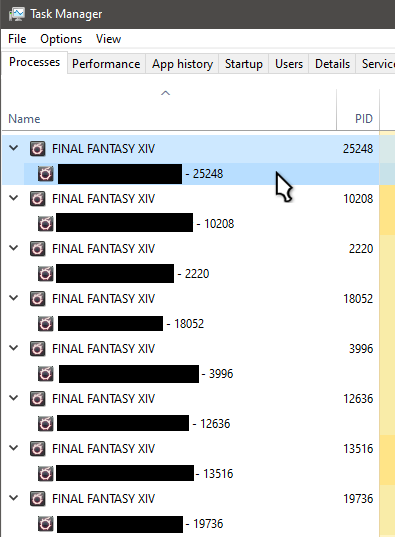

# FFXIV window cycle AutoHotkey script

Appends the process ID (PID) to your FFXIV window titles.  Only appends so it can work with other tools that change the FFXIV window title.

Use page up and page down keys to move forwards and backwards through your FFXIV windows, in PID order.

Install [AutoHotkey](https://www.autohotkey.com/) and run `ffxiv_window_cycle.ahk`

Here's how it looks in task manager.  I've hidden my character and server names, but you can see the PID being appended to the window title.

